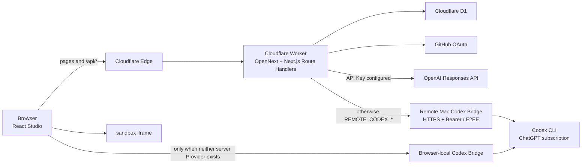

# Chance Atoms Demo：项目说明

Chance Atoms 是一个可运行、可部署的 AI 创作工作台 MVP，支持持续对话和自然语言构建 Web App。

> 预计阅读时间：5–10 分钟

- 在线 Demo：[chance-atoms-demo.chanceflying1.workers.dev](https://chance-atoms-demo.chanceflying1.workers.dev)
- GitHub：[chanceflying/chance-atoms-demo](https://github.com/chanceflying/chance-atoms-demo)
- 运行与部署：[README.md](README.md)

## 1. 项目目标

项目要验证的核心问题是：用户能否通过自然语言获得一个真正可运行、能够继续修改、过程可以追溯的 Web App，而不只是看到一次性的代码输出。

首版在有限时间内优先完成以下纵向闭环：

```text
输入需求 → 审阅方案 → 确认生成 → 运行预览 → 继续修改 → 保存新版本
```

当前仓库在这条主链路上继续补充了项目管理、持续对话、GitHub 登录、数据持久化和在线部署。项目不是纯前端：React 负责工作台交互，Next.js Route Handlers 是业务后端，Cloudflare Worker 和 D1 提供在线运行与数据存储。

## 2. 当前功能

### Web App 构建

- 输入自然语言需求，先生成结构化 BuildPlan；
- 用户可以继续调整方案，确认后才开始生成应用；
- 生成自包含的 HTML、CSS 和 JavaScript，无需安装依赖；
- 支持运行预览、代码查看、生成详情和 ZIP 导出；
- 可以继续用自然语言修改，并形成 v1、v2、v3 等不可变版本；
- 历史版本可以查看，并恢复为一个新的最新版本。

### 对话与长期记忆

- 每个对话都是独立项目，保存自己的消息历史；
- 用户消息会在模型请求前写入数据库，失败时问题不会消失；
- 用户可以显式开启、关闭和编辑项目级长期记忆；
- 当前浏览器内可以在等待回复时切换到其他项目；
- 当前浏览器内，同一对话限制同时发送多个请求，避免上下文顺序错乱。

### 项目与账号

- 访客无需注册即可创建和保存项目；
- 支持最近项目、分类筛选、项目改名和删除；
- GitHub OAuth 登录后会认领当前访客项目；
- 已保存项目可以在其他设备登录后继续使用；
- GitHub 仅用于身份登录，不会自动创建仓库或提交代码。

## 3. 技术架构



| 层级 | 技术 | 主要职责 |
| --- | --- | --- |
| 前端 | React 19、TypeScript | 首页、项目管理、构建交互、对话、版本和 Preview |
| 全栈框架 | Next.js 16 App Router | 页面路由与 Route Handlers 业务 API |
| 在线运行 | OpenNext、Cloudflare Worker | 将 Next.js 后端和静态资源部署到 Cloudflare |
| 数据 | Cloudflare D1、Drizzle migrations | 用户、Session、项目、版本、消息和记忆 |
| 模型 | OpenAI Responses API / Remote 或 Local Codex Bridge | 规划、生成和对话 |
| 产物运行 | sandbox iframe | 隔离运行模型生成的单文件 Web App |

Provider 优先级固定为 `OPENAI_API_KEY` > `REMOTE_CODEX_BRIDGE_URL/TOKEN` > 浏览器 localhost Bridge。Remote Bridge 通用模式支持 HTTPS + Bearer；本次因公司安全软件拦截 cloudflared，经用户授权改用 localhost.run，并设置 `REMOTE_CODEX_BRIDGE_E2EE=1`。Worker 与 Bridge 用共享 Token 派生 AES-256-GCM 密钥，Token、Prompt 和回复不以明文经过 Tunnel，但这仍只是临时演示链路。Bridge 默认端口为 4317，本次旧端口被占用后通过 `CODEX_BRIDGE_PORT=4318` 切换。恢复时需重启 Bridge/Tunnel 并更新临时 URL，面试后应关闭进程并删除 Remote Secret。

## 4. 实现思路与关键取舍

| 设计问题 | 当前选择 | 判断依据 |
| --- | --- | --- |
| 产品范围 | 聚焦浏览器 Web App | 统一输入、产物和验收方式，优先完成完整闭环 |
| 生成流程 | 先 BuildPlan，再确认生成 | 让用户在完整生成前修正方向，降低返工成本 |
| 产物形态 | 自包含单文件 HTML | Preview 与导出使用同一产物，不需要依赖安装和构建容器 |
| 版本策略 | 不可变完整快照 | 查询、预览和恢复语义简单，历史不会被覆盖 |
| 长期记忆 | 用户显式编辑的项目级文本 | 用户知道模型记住了什么，也容易验证和控制 |
| 工程组织 | Next.js 单仓全栈 + D1 | 共用 TypeScript 类型、同源 API 和一套部署链路 |

模型不会直接返回任意结构的数据。Web App 构建使用两个领域契约：

- `BuildPlan`：需求摘要、设计决策、交互流程、实现步骤和验收标准；
- `WebAppArtifact`：标题、描述、完整 HTML 和验收标准。

OpenAI Route 与 Codex Bridge 路径都执行 JSON Schema 约束和运行时校验。页面展示的是可审阅的方案和模型决策摘要，不是隐藏思维链。

## 5. 数据与版本设计

D1 主要保存五类数据：

- `projects`：Web App 与对话项目、标题、当前版本和记忆配置；
- `versions`：完整 Artifact、BuildPlan、模型信息和生成时间；
- `chat_messages`：对话角色、内容和模型元数据；
- `users`：GitHub 公共身份与账号工作区；
- `sessions`：Session Token Hash 和有效期。

每次 Web App 修改都会追加完整版本。恢复历史版本时，不覆盖旧版本，而是复制历史快照并创建新的最新版本。对于当前 Demo 的数据规模，这种方式用少量存储冗余换取了更简单、稳定和可解释的版本行为。

## 6. 当前完成程度

| 状态 | 内容 |
| --- | --- |
| 已完成 | 方案生成与调整、Web App 生成、Preview、代码查看、导出、版本演进与恢复、持续对话、长期记忆、项目管理、GitHub 登录、D1 持久化和 Cloudflare 部署 |
| 有明确限制 | Remote Codex 演示依赖 Mac 和临时 Tunnel 在线；后台任务只在浏览器会话内继续，刷新或关闭页面会中断；Preview 是 iframe 隔离，不是生产级代码沙箱 |
| 本版不做 | 多文件工程、生成后端、生成应用业务数据持久化、GitHub 仓库同步、自动 RAG、团队协作和计费 |

平台保存的是项目需求、方案、代码和版本，不保存用户在生成应用中的游戏分数、棋盘状态或其他运行数据。

## 7. 工程质量与交付

- 60 项自动测试，覆盖 OAuth、数据序列化、领域契约、模型路由、Bridge 鉴权与 E2EE、标题摘要、导出和页面静态约束；
- Worker HTTP smoke 覆盖项目 CRUD、版本创建与恢复、对话和 workspace 隔离；
- CI 执行 ESLint、TypeScript、自动测试和 Cloudflare Worker build；
- D1 Schema 使用 migration 管理；
- 项目已托管到 GitHub，并部署到 Cloudflare Worker。

当前自动化仍以单元、接口和构建验证为主，尚未补充完整的 Playwright E2E、视觉回归和浏览器矩阵。

## 8. 后续扩展与优先级

后续规划同时考虑业务闭环和工程基础，不以单纯增加功能数量为目标。

| 优先级 | 业务模块 | 配套工程能力 | 判断依据 |
| --- | --- | --- | --- |
| P0 | 应用一键发布、公开访问链接、版本发布与下线 | 配置正式线上 API Key、生产 smoke、发布状态和基础监控 | 用稳定 Provider 取代面试用临时 Tunnel，并补齐“创建—发布—使用”闭环 |
| P1 | 模板中心、示例应用、Prompt 引导 | 模板数据结构、模板版本和主链路 E2E | 降低首次使用门槛，提高创建成功率 |
| P1 | 为生成应用提供可选的数据保存、表单提交和轻量 API | 受控数据协议、权限隔离和持久任务 | 让生成结果从展示 Demo 变成可长期使用的应用 |
| P2 | 项目复制、分享编辑、GitHub 导出和版本 Diff | 幂等操作、乐观锁、异步任务和版本差异计算 | 提高成果复用和流转效率 |
| P2 | 团队工作区、成员角色、评论和发布审批 | RBAC、审计日志、并发控制和通知 | 在个人闭环稳定后扩展协作场景 |
| P3 | 模板市场、组件市场、使用额度和团队套餐 | 内容审核、检索推荐、计量、限流和账单 | 真实使用量得到验证后再建设平台生态和商业化 |

优先级判断是：先让生成结果能够被发布和真实使用，再通过模板与数据能力提高成功率和实用性；个人闭环稳定后，才扩展协作、市场和商业化。

## 9. 关键代码入口

| 路径 | 内容 |
| --- | --- |
| [`app/components/Studio.tsx`](app/components/Studio.tsx) | 工作台、项目切换、构建、对话和版本状态 |
| [`app/api/plan/route.ts`](app/api/plan/route.ts) | BuildPlan Structured Output |
| [`app/api/generate/route.ts`](app/api/generate/route.ts) | WebAppArtifact 生成 |
| [`app/api/chat/route.ts`](app/api/chat/route.ts) | 对话历史与长期记忆 |
| [`lib/remote-codex.ts`](lib/remote-codex.ts) | Worker 到远程 Codex Bridge 的配置、Bearer/E2EE 请求与超时 |
| [`app/api/projects`](app/api/projects) | 项目、版本和消息 API |
| [`db/schema.ts`](db/schema.ts) | D1 数据模型 |
| [`scripts/codex-session-bridge.mjs`](scripts/codex-session-bridge.mjs) | 本机 Codex Provider |
| [`.github/workflows`](.github/workflows) | CI 与 Cloudflare 部署 |

## 总结

Chance Atoms 的重点不是复刻一个功能庞杂的通用 AI IDE，而是在明确边界内完成一条可运行、可调整、可追溯和可部署的 AI Web App 构建链路。项目通过结构化方案、受约束的生成产物、不可变版本和清晰的 Provider 边界控制复杂度，并为后续发布、数据能力和团队协作保留了扩展空间。
