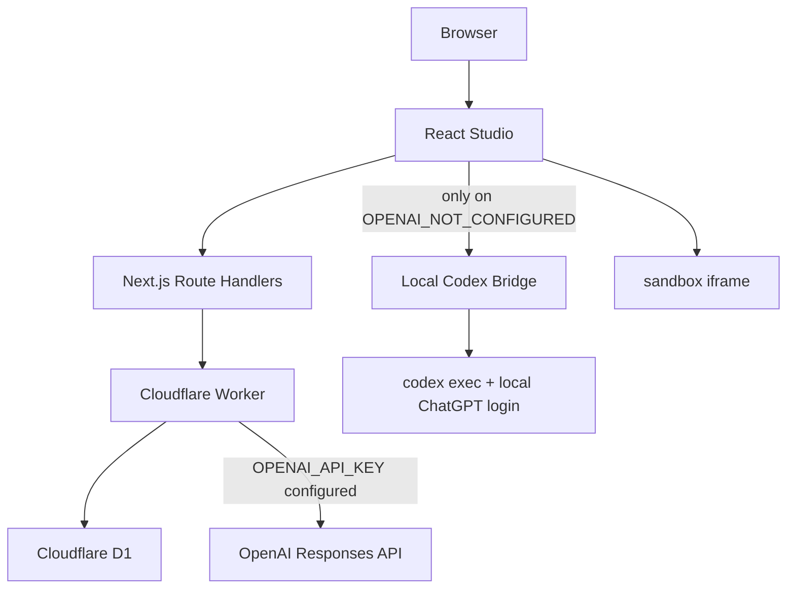

# Chance Atoms Demo · Forge

> 一个按 6–8 小时笔试时间盒收敛的 AI Web App Builder MVP。

Forge 是 Demo 内的产品名，`chance-atoms-demo` 是仓库、Cloudflare Worker 和交付项目名。用户用自然语言描述一个 Web App，模型先生成与请求对应的构建方案，用户确认后再生成可直接运行的单文件应用。项目支持继续修改、版本追溯、恢复和独立导出。

面试版本只提供一条产品主线：

```text
Prompt
  → 模型生成 BuildPlan + reasoning summary
  → 用户确认
  → 模型生成 WebAppArtifact
  → iframe 运行
  → D1 保存 v1
  → 自然语言修改
  → 新方案确认
  → D1 保存 v2 / v3
```

贪吃蛇、俄罗斯方块、扫雷只是示例 Prompt，不是写死的游戏模板。当前可见产品不提供 CRUD/Data App。

## 在线体验与源码

- 在线 Demo：[https://chance-atoms-demo.chanceflying1.workers.dev](https://chance-atoms-demo.chanceflying1.workers.dev)
- GitHub 源码：[https://github.com/chanceflying/chance-atoms-demo](https://github.com/chanceflying/chance-atoms-demo)

当前线上 Worker **尚未配置 `OPENAI_API_KEY`**。页面、GitHub 登录、项目与版本服务可以在线访问；真实规划和生成目前通过本机 Codex Bridge 验证。申请到 API Key 后不需要修改前端调用路径，只需给 Worker 配置 Secret。

## 核心演示

推荐用下面的流程向面试官演示：

1. 访客直接输入“生成一个俄罗斯方块”，或先使用 GitHub 登录。
2. 模型根据当前请求生成具体 `BuildPlan` 和用户可读的 reasoning summary。
3. 用户检查目标、设计决策、交互流程、实施步骤、假设和验收标准。
4. 用户确认方案后，模型才生成完整的 `WebAppArtifact`。
5. 生成的 HTML 在 sandbox iframe 中直接运行，并保存为 v1。
6. 输入“增加下一个方块预览和等级机制”，模型先规划本次改动，再生成 v2。
7. 在历史版本中分别预览 v1、v2；恢复 v1 时创建新的 v3，不覆盖任何历史版本。
8. 导出 ZIP，得到可独立打开或托管的 `index.html`。
9. 访客中途登录 GitHub 后，当前访客项目会被认领到账号工作区。

## 模型规划不是“原始思维链”

前端不再展示固定的预设执行清单。每一次新建或修改都真实请求模型生成与需求对应的 `BuildPlan`：

```ts
interface BuildPlan {
  schemaVersion: 1;
  kind: "web_app_plan";
  title: string;
  requestSummary: string;
  designDecisions: string[];
  interactionFlow: string[];
  implementationSteps: Array<{
    title: string;
    description: string;
  }>;
  assumptions: string[];
  acceptanceCriteria: string[];
}
```

页面同时展示模型返回的 reasoning summary，用来解释用户可理解的设计依据，例如为什么选择 Canvas、如何组织交互、哪些能力不在本次范围内。

这部分应称为“模型决策摘要”或“reasoning summary”，**不称为原始思维链**。它不是隐藏 reasoning token，也不是私有 chain-of-thought 的逐字转录。

确认方案后，生成阶段返回统一产物：

```ts
interface WebAppArtifact {
  schemaVersion: 1;
  kind: "web_app";
  title: string;
  description: string;
  html: string;
  acceptanceCriteria: string[];
}
```

`html` 是一个完整、自包含的 `index.html`：CSS 和 JavaScript 全部内联，不依赖 npm、构建工具、CDN、远程图片或服务端运行时。

## Provider 路由优先级

规划和生成都遵守同一套明确优先级：

1. 浏览器先请求同源的 `/api/plan` 或 `/api/generate`。
2. Worker 存在 `OPENAI_API_KEY` 时，服务端优先调用 OpenAI Responses API。
3. 只有服务端明确返回 `503 + OPENAI_NOT_CONFIGURED` 时，浏览器才回退到本机 `127.0.0.1:4317` 的 Codex Bridge。
4. 如果线上 Key 已配置但模型调用失败，错误会直接返回，不会静默切换 Provider。

因此“本机 Bridge”是当前无 API Key 阶段的真实模型验证入口，不是生产后端。它让本机 `codex exec` 复用已有的 ChatGPT/Codex 登录，Cloudflare 不运行 Codex CLI，也不接收本机登录凭证。

## 保存什么，不保存什么

### D1 持久化

- GitHub 用户和登录 Session；
- 访客或账号 workspace 下的项目；
- 原始 Prompt 和每次修改指令；
- 每个版本的 `BuildPlan`；
- 每个版本的 reasoning summary；
- 每个版本的完整 `WebAppArtifact`；
- Provider、模型、构建事件和创建时间；
- 项目当前版本号与完整版本历史。

### 不持久化

- 贪吃蛇当前分数、蛇身和食物位置；
- 俄罗斯方块当前棋盘、等级或下落中的方块；
- 扫雷当前局面；
- 任何生成应用内部的游玩记录或业务数据。

刷新 Preview、切换版本或重新打开项目后，生成应用的运行时状态会重新开始。这是面试 MVP 的明确边界。平台保存的是“如何生成并演进这个项目”，不是“用户在生成应用里做过什么”。

## 版本模型

- 首次确认方案并生成，创建不可变的 v1；
- 每次自然语言修改都先产生新的 BuildPlan，确认并生成后创建 v2、v3；
- 历史版本可独立预览，保留当时的 Prompt、修改指令、方案、摘要、产物和 Provider 信息；
- 历史版本不能被覆盖；
- “恢复 v1”会复制 v1 的完整快照并创建新的最新版本，例如 v3；
- 任意选中版本都可以导出为独立 ZIP。

这使核心闭环具备可追溯性：

```text
v1  初始需求：生成俄罗斯方块
v2  修改要求：增加触屏按钮
v3  恢复来源：v1（v1 和 v2 仍保留）
```

## GitHub 登录与访客认领

GitHub OAuth 是面试版本保留功能，但它只解决账号归属，不参与代码生成：

- 未登录用户拥有匿名 workspace，可以先生成和保存项目；
- 登录 GitHub 后，当前访客 workspace 的项目会被认领到账号 workspace；
- 再次登录或更换浏览器后，可以找回账号下的项目和完整版本历史；
- 退出后切回新的访客工作区；
- 登录不会把项目推送到 GitHub 仓库，也不请求仓库写权限。

面试版本不扩展团队成员、组织空间、RBAC、项目分享权限或 GitHub 仓库同步。

## 技术架构

这是一个单仓库全栈项目，不是纯前端页面。



各层职责：

- **React 19**：实现 Studio 页面、Prompt 输入、真实方案确认、生成状态、Preview、Code、版本列表、恢复和导出交互。
- **Next.js 16 App Router**：同一工程中的全栈应用框架；页面走 React，Route Handlers 提供模型、项目、版本、认证和导出 API。
- **OpenNext for Cloudflare**：把标准 Next.js 构建转换为 Cloudflare Worker 包，它是部署适配器，不是业务框架。
- **Cloudflare Worker**：公开运行 Next.js 服务端逻辑和静态资源；持有未来的服务端模型 Key，并连接 D1。
- **Cloudflare D1**：保存用户、Session、workspace、项目和不可变版本快照；每个版本包含 plan、summary 和 artifact。
- **OpenAI Responses API**：线上真实规划与生成 Provider；只在服务端 Key 存在时使用。
- **本机 Codex Bridge**：当前验证阶段的本地 Provider，提供 `/plan`、`/generate` 和 `/health`，不部署到 Worker。
- **sandbox iframe**：运行模型生成的单文件 HTML；运行时游戏状态只存在于 iframe 内存。

一句话解释 Cloudflare 的作用：

> Next.js/React 是前后端应用框架；Cloudflare 负责托管 Worker、静态资源和 D1 数据，不负责定义产品业务。

## 本地运行

需要 Node.js `>=22.13.0`。

```bash
npm ci
cp .env.example .env.local
npm run db:migrate:local
npm run dev
```

打开终端显示的本地地址。首次运行和新增 migration 后都需要执行 D1 migration。

### 当前推荐：使用本机 Codex Bridge

当前线上没有 API Key。先确认 Codex CLI 已通过 ChatGPT 登录：

```bash
codex login status
npm run model:bridge
```

保持 Bridge 终端运行，然后打开本地页面或线上 Demo。页面会先请求线上服务；收到明确的 `OPENAI_NOT_CONFIGURED` 后，自动调用：

```text
GET  http://127.0.0.1:4317/health
POST http://127.0.0.1:4317/plan
POST http://127.0.0.1:4317/generate
```

Bridge 默认只监听 `127.0.0.1:4317`。一次生成可能需要几十秒，取决于模型和产物复杂度。

### 未来启用服务端 OpenAI

```dotenv
OPENAI_API_KEY=your_server_side_key
OPENAI_MODEL=gpt-5.6-terra
```

本地开发可以写入 `.env.local`；Cloudflare 使用 Secret：

```bash
npx wrangler secret put OPENAI_API_KEY
```

配置后，`/api/plan` 和 `/api/generate` 会自动优先走服务端 OpenAI，不再触发本机 Bridge。

### 本地 GitHub OAuth

创建 GitHub OAuth App，并把 callback 配置为：

```text
http://localhost:3000/api/auth/github/callback
```

然后配置：

```dotenv
GITHUB_CLIENT_ID=your_github_oauth_client_id
GITHUB_CLIENT_SECRET=your_github_oauth_client_secret
```

未配置 GitHub OAuth 时，访客 workspace 和项目版本保存仍可使用。

## 本地 Worker 预览与 Smoke

构建并启动 Cloudflare Worker 预览：

```bash
npm run build:worker
npx opennextjs-cloudflare preview
```

在另一个终端运行：

```bash
npm run smoke
```

`smoke` 验证：

- 首页与访客 Session；
- workspace 隔离；
- Web App 项目保存；
- BuildPlan 与 reasoning summary 随版本持久化；
- 生成应用的 records 始终为空；
- v1 → v2 演进；
- rollback 创建新版本；
- 独立 ZIP 导出；
- 测试项目清理。

Smoke 使用固定测试 Artifact 验证平台链路，不调用收费模型，也不替代真实 Codex/OpenAI 手工生成验收。

## 质量检查

```bash
npm run lint
npm exec tsc -- --noEmit
npm test
npm run build:worker
```

当前自动测试重点覆盖：

- `BuildPlan` 与 `WebAppArtifact` 运行时契约和边界；
- 生成接口必须先收到已确认 BuildPlan；
- 未配置线上 Key 时返回精确的 Bridge 回退错误码；
- 旧的非 Web App Artifact 不能进入 Web App 生成链路；
- D1 项目、版本、plan、summary 和空 records 序列化；
- v1/v2/history/rollback-as-new-version；
- ZIP 导出保持生成 HTML 不被重写；
- GitHub OAuth state / PKCE、Session 与访客认领边界；
- Next.js 服务端渲染和 OpenNext 配置。

GitHub Actions 在 Linux + Node.js 22 环境执行 lint、类型检查、测试和 Worker 构建。

## 部署

首次部署需要先创建并迁移 D1，再构建 Worker：

```bash
npx wrangler login
npx wrangler d1 create chance-atoms-demo-db --binding DB --update-config
npm run db:migrate:remote
npm run build:worker
npm run deploy:worker
```

后续部署：

```bash
npm run deploy
```

启用 GitHub 登录：

```bash
npx wrangler secret put GITHUB_CLIENT_ID
npx wrangler secret put GITHUB_CLIENT_SECRET
```

生产 OAuth callback：

```text
https://chance-atoms-demo.chanceflying1.workers.dev/api/auth/github/callback
```

部署工作流补充说明见 [`.github/DEPLOYMENT.md`](.github/DEPLOYMENT.md)。

## 关键目录

- `app/components/Studio.tsx`：单一 Web App 工作台、真实方案确认、Preview、版本、恢复和导出。
- `app/api/plan/route.ts`：服务端 BuildPlan 与 reasoning summary 生成。
- `app/api/generate/route.ts`：接收已确认方案并生成 `WebAppArtifact`。
- `app/api/auth/`：GitHub OAuth、Session 查询与退出。
- `app/api/projects/`：访客/账号 workspace 下的项目和版本接口。
- `app/api/export/route.ts`：导出独立 Web App ZIP。
- `scripts/codex-session-bridge.mjs`：本机 Codex 订阅桥接。
- `scripts/web-app-plan.schema.json`：Bridge 的 BuildPlan 严格输出 Schema。
- `scripts/web-app-artifact.schema.json`：Bridge 的 WebAppArtifact 严格输出 Schema。
- `lib/domain.ts`：BuildPlan、WebAppArtifact、项目与版本领域类型。
- `lib/validation.ts`：BuildPlan 和 Artifact 运行时校验。
- `lib/export-project.ts`：无依赖 ZIP 生成。
- `db/schema.ts` 与 `drizzle/`：D1 Schema 和 migrations。
- `scripts/smoke-http.mjs`：Worker + D1 平台链路冒烟测试。
- `tests/model-routes.test.ts`：规划/生成路由边界测试。
- `tests/domain-runtime.test.ts`：领域契约测试。

## 关键 API

| Method | Path | MVP 用途 |
| --- | --- | --- |
| `POST` | `/api/plan` | 根据新建或修改请求生成 BuildPlan 与 reasoning summary |
| `POST` | `/api/generate` | 根据用户已确认的 BuildPlan 生成单文件 WebAppArtifact |
| `GET` | `/api/auth/github` | 发起 GitHub OAuth |
| `GET` | `/api/auth/github/callback` | 创建 Session，并把访客项目认领到账号 |
| `GET` | `/api/auth/session` | 查询当前账号 |
| `POST` | `/api/auth/logout` | 退出并撤销当前 Session |
| `GET / POST` | `/api/projects` | 查询或创建当前 workspace 的项目 |
| `GET / PATCH / DELETE` | `/api/projects/:id` | 查询、更新或删除项目 |
| `GET / POST` | `/api/projects/:id/versions` | 查询历史、创建版本或 rollback-as-new-version |
| `POST` | `/api/export` | 导出当前选中版本的独立 ZIP |

本机 Bridge API 不属于线上 Worker：

| Method | Path | 用途 |
| --- | --- | --- |
| `GET` | `http://127.0.0.1:4317/health` | 检查 Bridge 和 Provider 信息 |
| `POST` | `http://127.0.0.1:4317/plan` | 通过 Codex 订阅生成 BuildPlan 与摘要 |
| `POST` | `http://127.0.0.1:4317/generate` | 通过 Codex 订阅生成 WebAppArtifact |

## 面试版本取舍

MVP 优先证明“真实规划 → 用户确认 → 可运行生成 → 持续演进 → 可追溯版本”闭环，以下能力明确暂缓：

- 多文件工程、npm 依赖、在线 IDE、终端和任意构建命令；
- 生成后端、生成数据库和生成应用内部的数据持久化；
- 多 Agent 协作、模型竞速、流式 token、任务取消和自动修复循环；
- 团队空间、分享权限、GitHub 仓库同步、计费和模型额度管理；
- 版本代码 Diff、可视化编辑器和复杂分支合并；
- 大量动效、移动端精修、无障碍细节和精细错误引导；
- Rate Limiting、内容审核、生成代码扫描、独立预览域和完整生产级安全加固；
- 大规模浏览器矩阵、负载、故障恢复和长期任务队列。

为兼容早期迭代，仓库中可能仍保留少量旧类型或数据库字段，但它们不属于当前可见产品能力，也不应作为面试主线介绍。

## 面试说明口径

可以用下面这段话概括：

> 我没有在时间盒里复刻一个通用 AI IDE，而是收敛成单文件 Web App Builder。模型先输出请求特定、可校验的 BuildPlan 和用户可读决策摘要，用户确认后才生成代码。平台把每一次生成和修改保存成不可变版本，支持历史预览、恢复为新版本和独立导出；GitHub OAuth 负责项目归属，Cloudflare Worker 和 D1 负责在线运行与存储。生成应用自己的游戏状态不在持久化范围内。

## License

[MIT](LICENSE)
