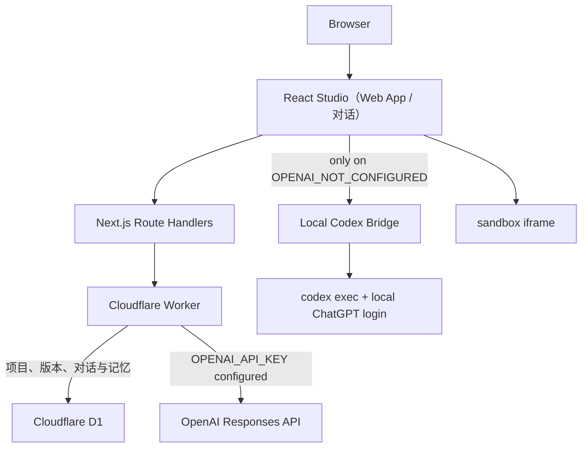

# Chance Atoms Demo

> 一个从 6–8 小时笔试基线继续迭代的 AI 创作工作台 MVP。

Chance Atoms 是 Demo 的产品名，`chance-atoms-demo` 同时也是仓库、Cloudflare Worker 和交付项目名。首版时间盒优先完成 Web App 生成主闭环；当前仓库是在该基线上的后续迭代版本，进一步加入了 GitHub 登录、版本管理、对话与长期记忆。用户现在可以创建两类项目：使用自然语言规划并生成可运行 Web App，或创建带可配置长期记忆的持续对话。两类项目共享 GitHub 登录、workspace、项目管理与删除能力。

Web App 构建主线：

```text
Prompt
  → 模型生成 BuildPlan + reasoning summary
  → 用户确认 / 提出调整意见
  → 模型基于当前方案继续优化（可重复）
  → 用户最终确认
  → 模型生成 WebAppArtifact
  → iframe 运行
  → D1 保存 v1
  → 自然语言修改
  → 新方案确认
  → D1 保存 v2 / v3
```

对话主线：

```text
创建对话项目
  → 用户发送消息
  → 当前对话历史 + 用户配置的长期记忆进入模型上下文
  → 保存用户消息和模型回复
  → 下次打开项目继续对话
```

贪吃蛇、俄罗斯方块、扫雷只是示例 Prompt，不是写死的游戏模板。当前 Web App 能力不提供 CRUD/Data App；长期记忆也只做显式配置，不做自动提取或向量检索。

## 在线体验与源码

- 在线 Demo：[https://chance-atoms-demo.chanceflying1.workers.dev](https://chance-atoms-demo.chanceflying1.workers.dev)
- GitHub 源码：[https://github.com/chanceflying/chance-atoms-demo](https://github.com/chanceflying/chance-atoms-demo)

当前线上 Worker **尚未配置 `OPENAI_API_KEY`**。页面、GitHub 登录、项目、版本、对话历史和记忆配置可以在线访问；真实规划、生成和对话目前通过本机 Codex Bridge 验证。申请到 API Key 后不需要修改前端调用路径，只需给 Worker 配置 Secret。

## 笔试交付摘要

| 原始要求 | 当前结论 | 可验证交付 |
| --- | --- | --- |
| 可运行的网页应用，具备类似 Atoms 的 AI 驱动生成与可视化展示 | **已完成** | Prompt 会进入真实模型规划与生成链路，产物直接在 iframe 中运行，并可查看代码与生成详情 |
| 具备真实交互，而不是纯静态页面 | **已完成** | 生成的游戏或交互应用可以直接操作；工作台本身也支持方案反馈、版本切换、恢复、导出、对话和删除 |
| 具备数据持久化 | **已完成（有明确边界）** | D1 持久化用户、Session、项目、版本、方案、产物、对话和记忆；生成应用内部的单局状态不持久化 |
| 覆盖初始化 / 注册或登录 / 核心主流程 | **已完成** | 访客可直接使用，GitHub OAuth 登录后可认领访客项目；Web App 和对话均形成完整主流程 |
| 至少一个延展或衍生能力 | **已完成** | Web App 支持自然语言持续演进和不可变版本；额外实现了可管理的对话项目与显式长期记忆 |
| 可测试的在线链接与公开 GitHub 源码 | **已完成** | 本 README 顶部提供线上 Demo 和 public GitHub 仓库链接 |
| 评审机器脱离本机环境直接调用线上模型 | **部分完成** | 服务端 OpenAI 接口已经实现，但 Worker 暂无 API Key；当前真实模型通过本机 Codex Bridge 验证 |

因此，当前交付不是静态概念稿：平台、数据和部署链路均在线可运行。唯一需要在演示前明确说明的外部依赖是模型 Provider——未配置线上 Key 时，评审者可以浏览和操作已保存内容，但新一轮规划、生成与对话需要在本机启动 Bridge。

## 核心演示

推荐用下面的流程向面试官演示：

1. 访客直接输入“生成一个俄罗斯方块”，或先使用 GitHub 登录。
2. 模型根据当前请求生成具体 `BuildPlan` 和用户可读的 reasoning summary。
3. 用户输入“加入触屏操作，并降低第一版复杂度”，模型基于当前方案重新规划；这个反馈循环可以重复。
4. 用户最终确认后，模型才生成完整的 `WebAppArtifact`。
5. 生成的 HTML 在 sandbox iframe 中直接运行，并保存为 v1。
6. 输入“增加下一个方块预览和等级机制”，模型先规划本次改动，再生成 v2。
7. 右侧用中文标签切换“预览 / 代码 / 生成详情”，并在历史版本中预览、恢复或导出。
8. 回到首页创建“对话”项目，配置一段长期记忆，发送消息后刷新或重新打开项目，历史仍然存在。
9. 删除一个对话或 Web App 项目，验证项目及其从属历史一起清理。
10. 访客中途登录 GitHub 后，当前访客项目会被认领到账号工作区。

## 模型规划不是“原始思维链”

前端不再展示固定的预设执行清单。每一次新建或修改都真实请求模型生成与需求对应的 `BuildPlan`：

```ts
interface BuildPlan {
  schemaVersion: 1;
  kind: "web_app_plan";
  title: string;
  requestSummary: string;
  designDecisions: string[];
  interactionFlow: string[];
  implementationSteps: Array<{
    title: string;
    description: string;
  }>;
  assumptions: string[];
  acceptanceCriteria: string[];
}
```

页面同时展示模型返回的 reasoning summary，用来解释用户可理解的设计依据，例如为什么选择 Canvas、如何组织交互、哪些能力不在本次范围内。

计划不是一次性的二选一弹窗。用户可以在当前 `BuildPlan` 下继续输入反馈，前端把 `currentPlan + planFeedback` 一起交给模型，让模型在保留有效决策的基础上返回一份完整的新方案。只有用户最终点击确认，才进入代码生成和版本保存；取消则放弃本轮规划。

这部分应称为“模型决策摘要”或“reasoning summary”，**不称为原始思维链**。它不是隐藏 reasoning token，也不是私有 chain-of-thought 的逐字转录。

确认方案后，生成阶段返回统一产物：

```ts
interface WebAppArtifact {
  schemaVersion: 1;
  kind: "web_app";
  title: string;
  description: string;
  html: string;
  acceptanceCriteria: string[];
}
```

`html` 是一个完整、自包含的 `index.html`：CSS 和 JavaScript 全部内联，不依赖 npm、构建工具、CDN、远程图片或服务端运行时。

## 对话与长期记忆

“对话”是与“Web App”并列的项目类型，不是构建页面里临时加的一块聊天框：

- 每个对话都有独立项目、消息历史和更新时间；
- 用户消息与模型回复都保存在 D1，重新打开项目可以继续；
- 用户可以打开或关闭长期记忆，并编辑一段项目级记忆内容；
- 开启时，前端把记忆内容和最近的对话历史一起发送给模型；关闭时不发送记忆内容；
- 对话使用与规划、生成相同的 Provider 优先级；
- 删除对话项目时，其消息历史一并删除。

这里的“长期记忆”是面试 MVP 中可解释、可验证的显式配置，不冒充模型自身的永久记忆。当前没有自动总结用户偏好、自动写回、Embedding、向量库、RAG、记忆冲突合并或跨项目共享；这些都记录在后续取舍中。

## Provider 路由优先级

规划、生成和对话都遵守同一套明确优先级：

1. 浏览器先请求同源的 `/api/plan`、`/api/generate` 或 `/api/chat`。
2. Worker 存在 `OPENAI_API_KEY` 时，服务端优先调用 OpenAI Responses API。
3. 只有服务端明确返回 `503 + OPENAI_NOT_CONFIGURED` 时，浏览器才回退到本机 `127.0.0.1:4317` 的 Codex Bridge。
4. 如果线上 Key 已配置但模型调用失败，错误会直接返回，不会静默切换 Provider。

因此“本机 Bridge”是当前无 API Key 阶段的真实模型验证入口，不是生产后端。它让本机 `codex exec` 复用已有的 ChatGPT/Codex 登录，Cloudflare 不运行 Codex CLI，也不接收本机登录凭证。

## 保存什么，不保存什么

### D1 持久化

- GitHub 用户和登录 Session；
- 访客或账号 workspace 下的 Web App 与对话项目；
- 原始 Prompt 和每次修改指令；
- 每个版本的 `BuildPlan`；
- 每个版本的 reasoning summary；
- 每个版本的完整 `WebAppArtifact`；
- Provider、模型、构建事件和创建时间；
- 项目当前版本号与完整版本历史；
- 对话项目的用户消息、模型回复、Provider 和模型信息；
- 对话项目的长期记忆开关和用户编辑的记忆内容。

### 不持久化

- 贪吃蛇当前分数、蛇身和食物位置；
- 俄罗斯方块当前棋盘、等级或下落中的方块；
- 扫雷当前局面；
- 任何生成应用内部的游玩记录或业务数据；
- 模型隐藏 reasoning token 或逐字思维链；
- 自动提取的用户画像、向量索引或跨项目记忆。

刷新 Preview、切换版本或重新打开项目后，生成应用的运行时状态会重新开始。这是面试 MVP 的明确边界。平台保存的是“如何生成并演进这个项目”，不是“用户在生成应用里做过什么”。

## 版本模型

- 首次确认方案并生成，创建不可变的 v1；
- 每次自然语言修改都先产生新的 BuildPlan，确认并生成后创建 v2、v3；
- 历史版本可独立预览，保留当时的 Prompt、修改指令、方案、摘要、产物和 Provider 信息；
- 历史版本不能被覆盖；
- “恢复 v1”会复制 v1 的完整快照并创建新的最新版本，例如 v3；
- 任意选中版本都可以导出为独立 ZIP。

这使核心闭环具备可追溯性：

```text
v1  初始需求：生成俄罗斯方块
v2  修改要求：增加触屏按钮
v3  恢复来源：v1（v1 和 v2 仍保留）
```

## GitHub 登录与访客认领

GitHub OAuth 是面试版本保留功能，但它只解决账号归属，不参与代码生成：

- 未登录用户拥有匿名 workspace，可以先生成和保存项目；
- 登录 GitHub 后，当前访客 workspace 的项目会被认领到账号 workspace；
- 再次登录或更换浏览器后，可以找回账号下的项目和完整版本历史；
- 退出后切回新的访客工作区；
- 登录不会把项目推送到 GitHub 仓库，也不请求仓库写权限。

面试版本不扩展团队成员、组织空间、RBAC、项目分享权限或 GitHub 仓库同步。

## 技术架构

这是一个单仓库全栈项目，不是纯前端页面。



各层职责：

- **React 19**：实现能力选择、项目管理、可反复调整的方案审阅、Web App 预览/代码/生成详情，以及对话与记忆配置。
- **Next.js 16 App Router**：同一工程中的全栈应用框架；页面走 React，Route Handlers 提供模型、对话、项目、版本、认证和导出 API。
- **OpenNext for Cloudflare**：把标准 Next.js 构建转换为 Cloudflare Worker 包，它是部署适配器，不是业务框架。
- **Cloudflare Worker**：公开运行 Next.js 服务端逻辑和静态资源；持有未来的服务端模型 Key，并连接 D1。
- **Cloudflare D1**：保存用户、Session、workspace、项目、Web App 不可变版本，以及对话消息和显式记忆配置。
- **OpenAI Responses API**：线上真实规划、生成与对话 Provider；只在服务端 Key 存在时使用。
- **本机 Codex Bridge**：当前验证阶段的本地 Provider，提供 `/plan`、`/generate`、`/chat` 和 `/health`，不部署到 Worker。
- **sandbox iframe**：运行模型生成的单文件 HTML；运行时游戏状态只存在于 iframe 内存。

一句话解释 Cloudflare 的作用：

> Next.js/React 是前后端应用框架；Cloudflare 负责托管 Worker、静态资源和 D1 数据，不负责定义产品业务。

## 本地运行

需要 Node.js `>=22.13.0`。

```bash
npm ci
cp .env.example .env.local
npm run db:migrate:local
npm run dev
```

打开终端显示的本地地址。首次运行和新增 migration 后都需要执行 D1 migration。

### 当前推荐：使用本机 Codex Bridge

当前线上没有 API Key。先确认 Codex CLI 已通过 ChatGPT 登录：

```bash
codex login status
npm run model:bridge
```

保持 Bridge 终端运行，然后打开本地页面或线上 Demo。页面会先请求线上服务；收到明确的 `OPENAI_NOT_CONFIGURED` 后，自动调用：

```text
GET  http://127.0.0.1:4317/health
POST http://127.0.0.1:4317/plan
POST http://127.0.0.1:4317/generate
POST http://127.0.0.1:4317/chat
```

Bridge 默认只监听 `127.0.0.1:4317`。一次生成可能需要几十秒，取决于模型和产物复杂度。

### 未来启用服务端 OpenAI

```dotenv
OPENAI_API_KEY=your_server_side_key
OPENAI_MODEL=gpt-5.6-terra
```

本地开发可以写入 `.env.local`；Cloudflare 使用 Secret：

```bash
npx wrangler secret put OPENAI_API_KEY
```

配置后，`/api/plan`、`/api/generate` 和 `/api/chat` 会自动优先走服务端 OpenAI，不再触发本机 Bridge。

### 本地 GitHub OAuth

创建 GitHub OAuth App，并把 callback 配置为：

```text
http://localhost:3000/api/auth/github/callback
```

然后配置：

```dotenv
GITHUB_CLIENT_ID=your_github_oauth_client_id
GITHUB_CLIENT_SECRET=your_github_oauth_client_secret
```

未配置 GitHub OAuth 时，访客 workspace 和项目版本保存仍可使用。

## 本地 Worker 预览与 Smoke

构建并启动 Cloudflare Worker 预览：

```bash
npm run build:worker
npx opennextjs-cloudflare preview
```

在另一个终端运行：

```bash
npm run smoke
```

`smoke` 验证：

- 首页与访客 Session；
- workspace 隔离；
- Web App / 对话项目创建、查询与删除；
- BuildPlan 与 reasoning summary 随版本持久化；
- 生成应用的 records 始终为空；
- v1 → v2 演进；
- rollback 创建新版本；
- 独立 ZIP 导出；
- 对话消息和长期记忆配置持久化；
- 测试项目清理。

Smoke 使用固定测试 Artifact 验证平台链路，不调用收费模型，也不替代真实 Codex/OpenAI 手工生成验收。

## 质量检查

```bash
npm run lint
npm exec tsc -- --noEmit
npm test
npm run build:worker
```

当前自动测试重点覆盖：

- `BuildPlan` 与 `WebAppArtifact` 运行时契约和边界；
- 生成接口必须先收到已确认 BuildPlan；
- 未配置线上 Key 时返回精确的 Bridge 回退错误码；
- 计划修订必须携带当前方案与用户反馈，对话历史和记忆有明确长度边界；
- 旧的非 Web App Artifact 不能进入 Web App 生成链路；
- D1 项目、版本、plan、summary 和空 records 序列化；
- 对话项目、两条消息原子保存、记忆配置和级联清理；
- v1/v2/history/rollback-as-new-version；
- ZIP 导出保持生成 HTML 不被重写；
- GitHub OAuth state / PKCE、Session 与访客认领边界；
- Next.js 服务端渲染和 OpenNext 配置。

GitHub Actions 在 Linux + Node.js 22 环境执行 lint、类型检查、测试和 Worker 构建。

## 部署

首次部署需要先创建并迁移 D1，再构建 Worker：

```bash
npx wrangler login
npx wrangler d1 create chance-atoms-demo-db --binding DB --update-config
npm run db:migrate:remote
npm run build:worker
npm run deploy:worker
```

后续部署：

```bash
npm run deploy
```

启用 GitHub 登录：

```bash
npx wrangler secret put GITHUB_CLIENT_ID
npx wrangler secret put GITHUB_CLIENT_SECRET
```

生产 OAuth callback：

```text
https://chance-atoms-demo.chanceflying1.workers.dev/api/auth/github/callback
```

部署工作流补充说明见 [`.github/DEPLOYMENT.md`](.github/DEPLOYMENT.md)。

## 关键目录

- `app/components/Studio.tsx`：双能力工作台、项目管理、可调整方案、Web App 版本能力、对话和记忆配置。
- `app/api/plan/route.ts`：服务端 BuildPlan 首次生成与基于用户反馈的方案修订。
- `app/api/generate/route.ts`：接收已确认方案并生成 `WebAppArtifact`。
- `app/api/chat/route.ts`：接收消息、最近对话历史和可选长期记忆，返回模型回复。
- `app/api/auth/`：GitHub OAuth、Session 查询与退出。
- `app/api/projects/`：访客/账号 workspace 下的项目、版本、对话消息和记忆配置接口。
- `app/api/export/route.ts`：导出独立 Web App ZIP。
- `scripts/codex-session-bridge.mjs`：本机 Codex 订阅桥接，覆盖规划、生成与对话。
- `scripts/chat-response.schema.json`：Bridge 对话回复的严格输出 Schema。
- `scripts/web-app-plan.schema.json`：Bridge 的 BuildPlan 严格输出 Schema。
- `scripts/web-app-artifact.schema.json`：Bridge 的 WebAppArtifact 严格输出 Schema。
- `lib/domain.ts`：BuildPlan、WebAppArtifact、项目与版本领域类型。
- `lib/validation.ts`：BuildPlan 和 Artifact 运行时校验。
- `lib/export-project.ts`：无依赖 ZIP 生成。
- `db/schema.ts` 与 `drizzle/`：D1 Schema 和 migrations。
- `scripts/smoke-http.mjs`：Worker + D1 平台链路冒烟测试。
- `tests/model-routes.test.ts`：规划/生成路由边界测试。
- `tests/chat-persistence.test.ts`：项目类型、消息序列化和迁移兼容测试。
- `tests/domain-runtime.test.ts`：领域契约测试。

## 关键 API

| Method | Path | MVP 用途 |
| --- | --- | --- |
| `POST` | `/api/plan` | 根据新建或修改请求生成 BuildPlan 与 reasoning summary |
| `POST` | `/api/generate` | 根据用户已确认的 BuildPlan 生成单文件 WebAppArtifact |
| `POST` | `/api/chat` | 根据消息、最近历史和可选长期记忆生成对话回复 |
| `GET` | `/api/auth/github` | 发起 GitHub OAuth |
| `GET` | `/api/auth/github/callback` | 创建 Session，并把访客项目认领到账号 |
| `GET` | `/api/auth/session` | 查询当前账号 |
| `POST` | `/api/auth/logout` | 退出并撤销当前 Session |
| `GET / POST` | `/api/projects` | 查询或创建当前 workspace 的项目 |
| `GET / PATCH / DELETE` | `/api/projects/:id` | 查询、更新或删除项目 |
| `GET / POST` | `/api/projects/:id/versions` | 查询历史、创建版本或 rollback-as-new-version |
| `GET / PATCH / POST` | `/api/projects/:id/chat` | 查询对话，配置长期记忆，或原子保存一轮问答 |
| `POST` | `/api/export` | 导出当前选中版本的独立 ZIP |

本机 Bridge API 不属于线上 Worker：

| Method | Path | 用途 |
| --- | --- | --- |
| `GET` | `http://127.0.0.1:4317/health` | 检查 Bridge 和 Provider 信息 |
| `POST` | `http://127.0.0.1:4317/plan` | 通过 Codex 订阅生成 BuildPlan 与摘要 |
| `POST` | `http://127.0.0.1:4317/generate` | 通过 Codex 订阅生成 WebAppArtifact |
| `POST` | `http://127.0.0.1:4317/chat` | 通过 Codex 订阅生成对话回复 |

## 实现思路与任务拆解

这道题的开放度很高。首版 6–8 小时时间盒里，我先把“做一个 Atoms”改写为一个可验收的问题：**用户能否用自然语言得到一个真的可运行、可以继续修改、且过程可追溯的 Web App？** 后续迭代再补齐登录、持久化、衍生能力和工程交付。下面的顺序既是任务拆解，也是每次增加范围时使用的优先级原则。

实现顺序遵循“先纵向闭环，再横向扩展”：

1. **先定义领域契约**：固定 `BuildPlan` 和 `WebAppArtifact` 的结构、边界与运行时校验，避免 UI、API 和模型输出各自理解一套格式。
2. **打通最短生成闭环**：Prompt → 方案 → 用户确认 → 单文件 HTML → iframe 预览，先证明核心价值成立。
3. **补上可控性与演进能力**：允许用户基于当前方案继续反馈；每次生成保存为不可变版本，并支持恢复和导出。
4. **补上平台完整性**：使用 D1 保存 workspace 和项目，引入访客模式、GitHub OAuth、项目删除及访客项目认领。
5. **实现一个边界清楚的衍生能力**：增加独立的对话项目和用户显式配置的长期记忆，复用项目管理、持久化和 Provider 路由。
6. **最后完成交付闭环**：补齐 migration、自动测试、Worker smoke、CI、线上部署和运行文档。

这个拆法刻意避免一开始就做在线 IDE、多文件构建容器或通用 Agent 编排。那些能力很“像平台”，但会先消耗时间在基础设施上，反而无法稳定证明题目要求的核心用户价值。

## 技术方案与关键实现细节

| 模块 | 实现方式 | 关键价值 |
| --- | --- | --- |
| 领域契约 | [`lib/domain.ts`](lib/domain.ts) 定义带 `schemaVersion` 的 `BuildPlan` 与 `WebAppArtifact`，[`lib/validation.ts`](lib/validation.ts) 做运行时校验 | 把模型输出从自由文本变成前后端都能验证的业务合同，错误在保存和运行前暴露 |
| 方案生成与修订 | `/api/plan` 接收初始需求；修订时同时接收 `currentPlan + planFeedback + previousArtifact`，每次返回一份完整新方案 | 用户不是只能“确认 / 取消”，而是可以在当前思路上多轮收敛，最终确认后才消耗生成成本 |
| 代码生成 | `/api/generate` 要求携带已确认的 BuildPlan，通过 Responses API 的严格结构化输出生成一个自包含 `index.html` | 方案与实现形成显式边界；单文件产物不需要安装依赖或执行任意构建命令 |
| 预览与导出 | 同一份 HTML 使用 `sandbox="allow-scripts allow-forms allow-modals"` 的 iframe 运行，并原样写入导出 ZIP | 工作台预览和用户下载的产物一致，减少“预览能跑、导出不能跑”的环境差异 |
| 持久化 | D1 中使用 `projects`、`versions`、`chat_messages`、`users`、`sessions` 等表；Drizzle 维护 Schema 和 migration | 数据模型覆盖访客/账号 workspace、项目类型、版本历史、对话历史和长期记忆；`workspace_id` 是逻辑所有权命名空间，不是独立数据表 |
| 版本演进 | `(project_id, version)` 唯一约束；每次生成写入完整快照；恢复历史版本时复制快照并创建新的最新版本 | 历史不可变、修改可追溯，也避免原地回滚导致的审计信息丢失 |
| 对话与记忆 | `/api/chat` 最多接收最近 40 条历史；记忆由用户按项目显式开关和编辑，问答以 D1 batch 一次保存 | 在有限上下文内保持连续性，同时让“记住了什么”可见、可控、可验证 |
| 登录与归属 | GitHub OAuth 使用 state + PKCE；Session 只保存 token hash；登录回调通过 D1 batch 原子完成用户、Session 与访客项目认领 | 登录只解决身份与数据归属，不获取仓库写权限，也不耦合生成逻辑 |
| Provider 路由 | 浏览器先请求同源服务端；只有收到精确的 `503 + OPENAI_NOT_CONFIGURED` 才回退本机 Bridge | 有线上 Key 时始终优先使用服务端模型；缺 Key 时仍能用已有 Codex 订阅验证真实生成 |
| 并发与错误边界 | 前端用 request id、workspace epoch 和 in-flight guard 丢弃项目切换后的过期响应；服务端限制请求体、输入长度与 HTML 大小 | 降低慢模型请求、切换项目和重复点击造成的串项目或重复写入风险 |
| 工程验证 | 46 个自动测试覆盖领域契约、模型路由、OAuth、D1 序列化、版本、导出和渲染；HTTP smoke 覆盖 Worker + D1 主链路；CI 执行 lint、typecheck、test、Worker build | 把“本机看起来能用”提升为可以持续回归和重新部署的交付物 |

## 关键取舍与复杂度控制

| 设计问题 | 本版选择 | 为什么这样取舍 | 暂时放弃的能力 |
| --- | --- | --- | --- |
| 通用 AI IDE 还是聚焦场景 | 只生成前端 Web App | 统一输入、产物和验收方式，能在时间盒内把核心链路做完整 | 后端生成、数据库生成、任意技术栈和终端 |
| 多文件工程还是单文件产物 | 自包含 `index.html` | 无需容器、依赖安装和构建队列；预览、存储、版本和导出都处理同一产物 | npm 生态、多文件 Diff、复杂框架工程 |
| 是否展示“真实思维链” | 展示结构化 BuildPlan 和用户可读决策摘要 | 这是真实模型输出且可审阅，但不冒充模型私有 chain-of-thought | 原始 reasoning token 的逐字展示 |
| 版本如何保存 | 不可变完整快照，恢复也创建新版本 | 逻辑简单、查询稳定、演进可追溯，符合 Demo 数据规模 | 增量存储、分支、合并和 Git 式历史 |
| 数据持久化到哪里 | 平台数据持久化，生成应用运行时状态留在 iframe 内存 | 先满足项目可找回和版本可追踪，避免为任意生成代码设计通用存储协议 | 游戏进度、用户业务数据和生成后端 |
| 长期记忆怎么做 | 用户显式配置的项目级文本 | 可解释、容易验证，用户知道哪些信息进入模型 | 自动提取、Embedding、RAG、冲突合并和跨项目画像 |
| 前后端与部署如何组织 | Next.js 单仓全栈 + Worker + D1 | 一套类型、一套部署和同源 API，降低面试版本的服务治理成本 | 微服务、独立 API 网关和异步任务基础设施 |
| 无 API Key 如何验证 | 保留服务端 Key 入口，且仅在未配置时回退本机 Codex Bridge | 线上方案不被本机方案锁死，同时复用现有订阅完成真实模型验收 | 把个人会话凭证上传云端或伪装成生产 Provider |
| 安全与体验做到什么程度 | 保留输入校验、OAuth state/PKCE、Session hash 和 iframe sandbox 等基本边界；其余记录为后续项 | 当前目标是快速证明可用闭环，而不是声称已经达到生产级 | 限流、审核、生成代码扫描、独立预览域、完整移动端与无障碍精修 |

## 当前完成程度与明确边界

### 已完成

- Web App 的真实规划、方案多轮调整、确认生成、可运行预览、代码与生成详情查看；
- 使用自然语言继续修改，保存 v1/v2/v3 等不可变版本，历史预览、恢复为新版本和 ZIP 导出；
- 访客 workspace、GitHub 登录、访客项目认领、项目列表与删除；
- D1 持久化项目、版本、BuildPlan、决策摘要、产物、Provider 信息、对话、记忆、用户和 Session；
- 独立对话项目、历史保存，以及用户显式控制的项目级长期记忆；
- 服务端 OpenAI Provider、本机 Codex Bridge Provider 及严格回退条件；
- Cloudflare Worker + D1 线上部署、public GitHub 仓库、migration、CI、46 个自动测试和 HTTP smoke。

### 部分完成

- **线上真实模型**：代码路径已经完成，但线上 Worker 暂未配置 `OPENAI_API_KEY`；真实生成当前依赖演示者本机 Bridge。
- **Provider 状态表达**：README 已说明真实可用范围，但页面仍偏向展示静态“在线”状态，没有在加载时明确区分“服务端模型 / 本机 Bridge / 未连接”。
- **生成等待体验**：有阶段状态、错误提示和重试入口，但没有流式 token、可取消任务、后台队列或断点恢复；复杂应用可能等待几十秒。
- **生成结果验收**：Artifact 已做结构、类型、长度和外部依赖约束，但 BuildPlan 中的 acceptance criteria 尚未在浏览器中逐条执行，也未捕获运行时错误触发自动修复。
- **自动化验证**：已有单元/集成测试和 HTTP smoke，但没有 Playwright 级浏览器端到端测试、视觉回归、浏览器矩阵、负载与故障注入。
- **模型调用与数据写入的一致性**：Web App 先完成模型生成再保存版本；对话先获得回复，再以 D1 batch 保存一轮消息。D1 内部写入可以原子提交，但模型请求与数据库写入不是同一个事务，当前也没有 operation id、幂等键或异步任务状态机。
- **响应式与可访问性**：核心桌面流程可用，生成 Prompt 也要求产物支持键盘、触屏和响应式；工作台自身尚未做系统性的移动端与无障碍审计。

### 本版明确不做

- 多文件工程、npm 依赖、在线 IDE、终端和任意构建命令；
- 生成后端、生成数据库和生成应用内部的数据持久化；
- 多 Agent 协作、模型竞速、流式 token、任务取消和自动修复循环；
- 对话消息编辑/重试、分支对话、附件、联网搜索和多模态输入；
- 自动记忆提取、自动摘要写回、Embedding、向量检索、记忆冲突处理和跨项目记忆；
- 团队空间、分享权限、GitHub 仓库同步、计费和模型额度管理；
- 版本代码 Diff、可视化编辑器和复杂分支合并；
- 大量动效、完整移动端精修、系统性无障碍支持、乐观更新和精细错误引导；
- Rate Limiting、内容审核、生成代码扫描、独立预览域和完整生产级安全加固；
- 大规模浏览器矩阵、负载、故障恢复和长期任务队列。

为兼容早期迭代，仓库中可能仍保留少量旧类型或数据库字段，但它们不属于当前可见产品能力，也不应作为面试主线介绍。

## 如果继续投入：扩展路线与优先级

优先级不按“功能看起来有多大”排序，而按 **是否补齐评审可验证的短板、能否提高主链路稳定性、投入产出比** 排序。

| 优先级 | 时间预估 | 下一步 | 判断依据 |
| --- | --- | --- | --- |
| **P0：面试前交付闭环** | 0.5 天 | 增加 Provider 可用性预检，准确显示“服务端模型 / 本机 Bridge / 未连接”；获得 Key 后配置 Worker Secret 并做一次生产生成 smoke；增加 `npm run verify`、CI badge、3 分钟演示录屏或 GIF | 先消除“页面显示在线但评审者无法生成”的最大交付风险，并让运行证据一眼可见 |
| **P1：稳定性与可诊断性** | 1–2 天 | 增加 Playwright 关键路径 E2E、写接口幂等键、模型调用 trace id/阶段耗时、失败重试与取消；把 3000+ 行 `Studio.tsx` 拆成构建、对话、项目和版本模块，并统一三类模型路由的 Provider adapter | 这些改动直接提高完成度和工程质量，也能降低慢请求下的偶发问题和后续修改成本 |
| **P2：体验与创新闭环** | 3–5 天 | 流式展示规划/生成阶段；把 BuildPlan 的验收标准转成浏览器断言，生成后自动运行并输出报告，失败时最多触发一次受控修复；增加 Plan/代码版本 Diff；补齐对话自动滚动、Markdown、记忆未保存提示 | 让“生成完成”升级为“生成且验证完成”，同时改善长任务和长期对话体验，是最能体现 Agent 工程视角的产品亮点 |
| **P3：平台能力扩展** | 1–2 周以上 | 引入隔离构建沙箱、多文件工程、依赖白名单、生成后端；再评估自动记忆/RAG、团队协作和 GitHub 同步 | 基础闭环稳定后再扩展产物边界，否则会同时放大安全、成本和运维复杂度 |

这里最重要的优先级判断是：**不先做更多项目类型，也不先做自动 RAG**。当前最有价值的是让线上模型可独立验证、主链路可自动回归，再把已有的 acceptance criteria 发展成“生成 → 执行 → 评估 → 有界修复”闭环。

## 按评估维度复盘与优化

| 评估维度 | 当前优势 | 主要短板 | 最值得做的优化 |
| --- | --- | --- | --- |
| **完成度** | 两条产品闭环、登录、持久化、版本、删除、部署和测试都已落地 | 线上模型 Key 缺失；没有浏览器 E2E、行为级验收、幂等重试和长任务恢复 | P0 配置线上 Provider；P1 补关键路径 E2E、写接口幂等和失败恢复 |
| **工程思维** | 先定义结构化契约，再做纵向闭环；Provider、数据边界和版本语义清楚；有 migration 和 CI | `Studio.tsx` 职责过重，构建流程仍是隐式状态组合；缺少结构化观测 | 拆分领域 hooks/组件，引入显式状态机或 reducer，并记录 trace id、阶段耗时和错误码 |
| **用户体验** | 访客可直接开始；方案可反复调整；中文标签、历史版本、恢复、导出和删除路径清楚 | Provider 状态不够准确；模型等待较长且反馈粒度有限；长期记忆缺少未保存提示；移动端与无障碍未系统验证 | 增加可用性预检、流式阶段进度、取消/重试、记忆自动保存或脏状态提示、键盘焦点和移动端专项验收 |
| **创新性** | 将“方案评审”放在代码生成前；同一项目支持自然语言演进和可追溯版本；长期记忆边界可解释 | acceptance criteria 目前只是模型产物，没有进入自动执行；版本之间不可视化比较 | 建立自动验收与一次有界自修复闭环，再补方案/代码/运行结果的版本 Diff |
| **可交付性** | 在线地址、public 仓库、本地/Worker 运行文档、migration、CI、46 个测试和 smoke 齐全 | 外部评审者仍依赖本机 Bridge 才能新生成；缺截图/录屏和一键全量校验命令 | 配置线上 Key，提供 CI badge、演示视频、`npm run verify` 和部署后 smoke 记录 |

从五个维度综合看，最值得优先投入的三项不是继续扩功能，而是：

1. **让线上模型对评审者独立可用，并补一条浏览器级回归链路**；
2. **把 acceptance criteria 变成自动验收与有界修复闭环**，形成真正的创新亮点；
3. **拆分工作台大组件并增加结构化 trace**，让现有能力更容易解释、维护和扩展。

## 面试说明口径

可以用下面这段话概括：

> 我没有在时间盒里复刻一个通用 AI IDE，而是把工作台收敛成两个边界清楚的项目类型。Web App 模式中，模型先输出可校验的 BuildPlan，用户可以在当前方案上反复反馈，最终确认后才生成代码；每次生成和修改都保存成不可变版本，支持预览、恢复和导出。对话模式保存消息历史，并提供用户显式控制的项目级长期记忆，但不在 MVP 里做自动 RAG。GitHub OAuth 负责项目归属，Next.js Route Handlers 承担后端业务，Cloudflare Worker 和 D1 负责在线运行与存储。

## License

[MIT](LICENSE)
